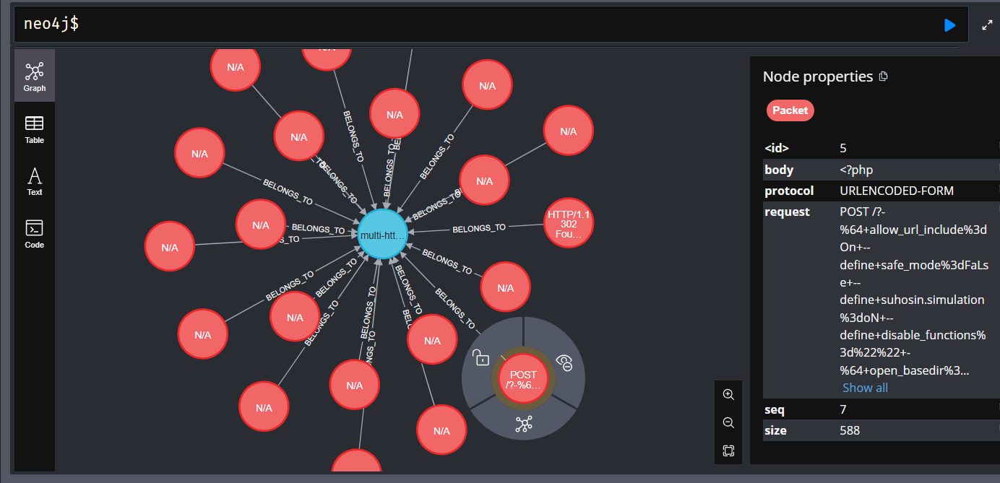
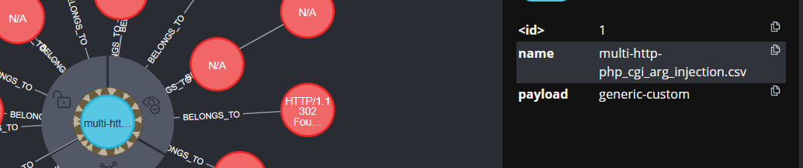

# ✨ CTI Database for WordPress and PHP Exploits ✨

This repository contains an application designed to capture and store data related to **WordPress** and **PHP exploits** in a **Neo4j database**, aiding in Cyber Threat Intelligence (CTI) to help mitigate potential attacks. Exploit data is gathered through automated execution of Metasploit modules, with network traffic captures analyzed and saved into a graph database structure. The focus is placed on identifying and analyzing Layer 7 (application layer) HTTP traffic, particularly for web applications.

---

## 🌐 Features

- ⚖️ **Graph-based Threat Intelligence**: Organizes exploit data into relationships for better attack pattern analysis.
- ⚡ **Focus on Layer 7 HTTP Traffic**: Targets exploits in web applications, such as WordPress and PHP vulnerabilities.
- ⏳ **Fast and Scalable**: Leverages the Neo4j graph database for rapid querying and visualization.
- 🌍 **Dockerized Environment**: Easy installation and setup using Docker Compose.

---

## 🔧 Installation

### Prerequisites

- [Docker](https://www.docker.com/)
- [Docker Compose](https://docs.docker.com/compose/)

### Steps

1. Clone this repository:

   ```bash
   git clone https://github.com/by2waysprojects/metasploit-db.git
   cd metasploit-db
   ```

2. Create a `.env` file in the root directory with the following configuration:

   ```env
   NEO4J_DB=neo4j://neo4j:7687
   NEO4J_USER=neo4j
   NEO4J_PASSWORD=password
   SERVER_PORT=8080
   ```

3. Start the services using Docker Compose:

   ```bash
   docker-compose up --build
   ```

4. The Neo4j database will be accessible at [http://localhost:7474](http://localhost:7474), and the application server will run on [http://localhost:8080](http://localhost:8080).

---

## 🔎 Usage

### Endpoint to Load Data

Once the services are up, you can load exploit data captured in network traffic by making a `GET` request to the endpoint:

```
GET /save-wp-php
```

This endpoint processes all relevant HTTP traffic at Layer 7 and populates the Neo4j database with structured data about exploits, including:

- Attack sequences
- Exploit payloads
- Relationships between attackers, victims, and exploited vulnerabilities

---

## 📊 Data Structure

The following fields are stored for each exploit:

- **Sequence Number (Seq)**: The sequence of packets in the attack.
- **Size**: The size of the attack payload.
- **Protocol**: The network protocol used.
- **Request**: Details of the exploit request.
- **Body**: Exploit payload or malicious data.

---

## 📈 Visualization Example

Here are two sample screenshots of the Neo4j graph visualization, demonstrating the relationship between exploits, payloads, and HTTP responses:





---

## 💎 Key Benefits

- Enhances security teams' ability to recognize and mitigate threats.
- Provides actionable insights from attack patterns.
- Offers an extendable framework for other exploit types.

---

## 💡 Technologies Used

- **Go**: For backend services.
- **Python**: For data parsing and traffic analysis.
- **Neo4j**: As the graph database.
- **Docker Compose**: For simplified deployment.

---

## ⚠ Disclaimer

This application is intended for ethical use only. It should be used exclusively for defensive and educational purposes. Misuse of this tool is strictly prohibited.

---

## 👮 Contributing

Feel free to fork this repository and submit pull requests. Contributions are always welcome!

---

## 🛠 Support

If you encounter any issues, please open an [issue](https://github.com/by2waysprojects/metasploit-db/issues) in this repository.

---

## 🔑 License

This project is licensed under the Apache-2.0 License. See the LICENSE file for details.